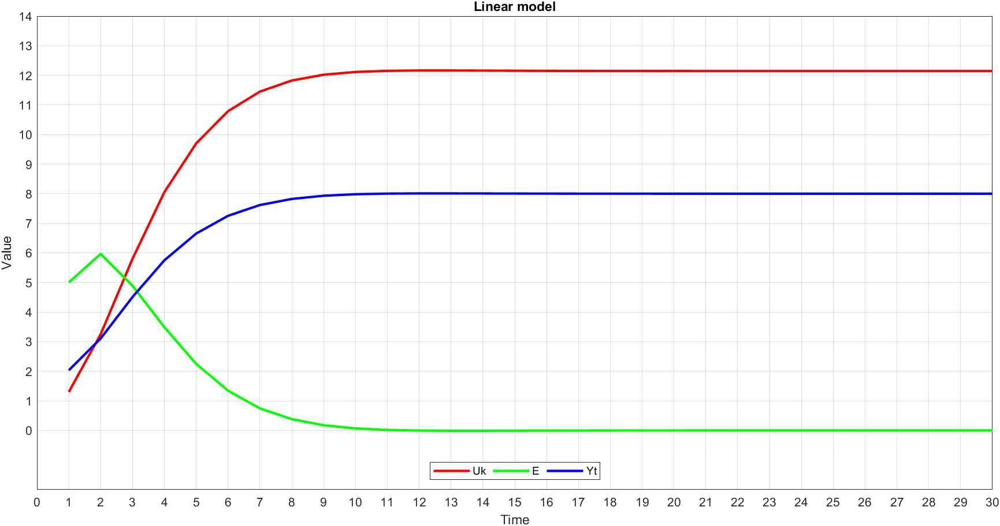
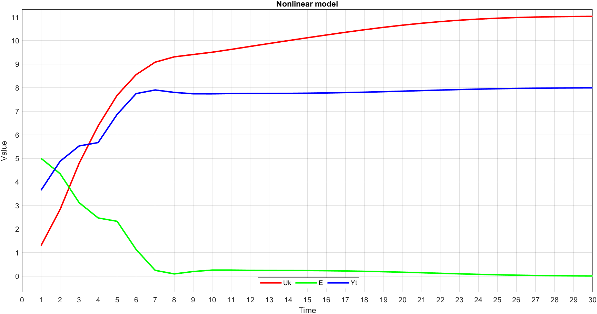

# Лабораторная работа №2
<p align="center">Министерство образования Республики Беларусь</p>
<p align="center">Учреждение образования</p>
<p align="center">«Брестский государственный технический университет»</p>
<p align="center">Кафедра ИИТ</p>
<br><br><br><br>
<p align="center">Лабораторная работа №2</p>
<p align="center">По дисциплине: «ТИМАУ»</p>
<br><br><br>
<p align="right">Выполнила</p>
<p align="right">Студентка 3-го курса</p>
<p align="right">Группы АС-64</p>
<p align="right">Будник А.А.</p>
<p align="right">Проверил</p>
<p align="right">Иванюк Д.С.</p>
<br><br><br>
<p align="center">Брест 2024</p>

---

## Ход работы

Задача: Реализовать программу на C++, которая моделирует ПИД-регулятор, используя математическую модель, полученную в предыдущем задании, в качестве объекта управления. Программа должна использовать объектно-ориентированное программирование и включать как минимум 3 класса (с наследованием). Необходимо предоставить графики для различных параметров температуры объекта и объяснение результатов в отчете, который генерируется с помощью Doxygen в формате .md.

**Реализация:**
Программа состоит из 4 классов:

1. **Model** — абстрактный класс, представляющий модель.
2. **LinearModel** — класс, представляющий линейную модель.
3. **NonlinearModel** — класс, представляющий нелинейную модель.
4. **PIDregulator** — класс для реализации ПИД-регулятора.

Для ПИД-регулятора заданы следующие параметры:  
K = 0.1, T = 10, TD = 80, T0 = 50.

В программе используются классы с наследованием для моделирования разных типов систем (линейной и нелинейной) и их управления с помощью ПИД-регулятора, который рассчитывает выходное значение в зависимости от ошибки и предыдущих отклонений.

## Результат

```
	---LinearModel---
E = 5.000000, Yt = 3.650000, Uk = 1.300000
E = 4.350000, Yt = 4.415500, Uk = 2.831000
E = 3.584500, Yt = 5.455485, Uk = 4.910970
E = 2.544515, Yt = 6.277652, Uk = 6.555304
E = 1.722348, Yt = 6.890098, Uk = 7.780196
E = 1.109902, Yt = 7.306840, Uk = 8.613680
E = 0.693160, Yt = 7.579135, Uk = 9.158270
E = 0.420865, Yt = 7.750366, Uk = 9.500732
E = 0.249634, Yt = 7.855106, Uk = 9.710212
E = 0.144894, Yt = 7.917597, Uk = 9.835193
E = 0.082403, Yt = 7.954076, Uk = 9.908151
E = 0.045924, Yt = 7.974933, Uk = 9.949867
E = 0.025067, Yt = 7.986621, Uk = 9.973243
E = 0.013379, Yt = 7.993037, Uk = 9.986074
E = 0.006963, Yt = 7.996483, Uk = 9.992966
E = 0.003517, Yt = 7.998289, Uk = 9.996578
E = 0.001711, Yt = 7.999209, Uk = 9.998418
E = 0.000791, Yt = 7.999662, Uk = 9.999323
E = 0.000338, Yt = 7.999874, Uk = 9.999748
E = 0.000126, Yt = 7.999967, Uk = 9.999935
E = 0.000033, Yt = 8.000004, Uk = 10.000007
E = -0.000004, Yt = 8.000015, Uk = 10.000029
E = -0.000015, Yt = 8.000015, Uk = 10.000030
E = -0.000015, Yt = 8.000012, Uk = 10.000025
E = -0.000012, Yt = 8.000009, Uk = 10.000018
E = -0.000009, Yt = 8.000006, Uk = 10.000012
E = -0.000006, Yt = 8.000004, Uk = 10.000008
E = -0.000004, Yt = 8.000002, Uk = 10.000005
E = -0.000002, Yt = 8.000002, Uk = 10.000003
E = -0.000002, Yt = 8.000001, Uk = 10.000002

	---NonlinearModel---
E = 5.000000, Yt = 4.760000, Uk = 1.300000
E = 3.240000, Yt = 2.404836, Uk = 2.542400
E = 5.595164, Yt = 2.867666, Uk = 5.056343
E = 5.132334, Yt = 3.177210, Uk = 7.356763
E = 4.822790, Yt = 3.871191, Uk = 9.916501
E = 4.128809, Yt = 4.192183, Uk = 12.196988
E = 3.807817, Yt = 4.621690, Uk = 14.288972
E = 3.378310, Yt = 5.125363, Uk = 16.132567
E = 2.874637, Yt = 5.310702, Uk = 17.759488
E = 2.689298, Yt = 5.557175, Uk = 19.229206
E = 2.442825, Yt = 5.944945, Uk = 20.539426
E = 2.055055, Yt = 6.239183, Uk = 21.699454
E = 1.760817, Yt = 6.371262, Uk = 22.712523
E = 1.628738, Yt = 6.455092, Uk = 23.605669
E = 1.544908, Yt = 6.583971, Uk = 24.419375
E = 1.416029, Yt = 6.768908, Uk = 25.171733
E = 1.231092, Yt = 6.974355, Uk = 25.852285
E = 1.025645, Yt = 7.154705, Uk = 26.444004
E = 0.845295, Yt = 7.285212, Uk = 26.942807
E = 0.714788, Yt = 7.369227, Uk = 27.360379
E = 0.630773, Yt = 7.422555, Uk = 27.716810
E = 0.577445, Yt = 7.459263, Uk = 28.031774
E = 0.540737, Yt = 7.487916, Uk = 28.319485
E = 0.512084, Yt = 7.513142, Uk = 28.588277
E = 0.486858, Yt = 7.537588, Uk = 28.842344
E = 0.462412, Yt = 7.562895, Uk = 29.083454
E = 0.437105, Yt = 7.590030, Uk = 29.311991
E = 0.409970, Yt = 7.619386, Uk = 29.527538
E = 0.380614, Yt = 7.650847, Uk = 29.729232
E = 0.349153, Yt = 7.683882, Uk = 29.916056


=== Code Execution Successful ===
```

### Linear model



### Nonlinear model


## Заключение

Программа демонстрирует работу ПИД-регулятора, который с каждым шагом корректирует управляющий сигнал на основе отклонений от заданного значения температуры. Реализованные модели (линейная и нелинейная) показывают различные реакции системы на изменения параметров, такие как увеличение точности или более сложные зависимости, включая квадратичные и синусоидальные элементы.

Результаты симуляций дают представление о том, как разные параметры ПИД-регулятора (коэффициент усиления, время интеграции и дифференциации) влияют на стабилизацию температуры в управляемой системе. Использование графиков и анализ полученных данных позволяет лучше понять поведение системы и точность регулирования, а также на основе таких данных можно оптимизировать параметры для достижения более точных и быстрых результатов.

Таким образом, данная программа является хорошей иллюстрацией применения ПИД-регуляторов в системах с различными типами моделей, а также предоставляет полезный инструмент для анализа и оптимизации работы таких систем.