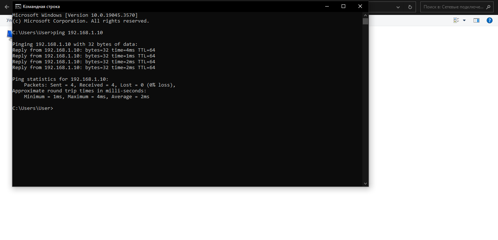
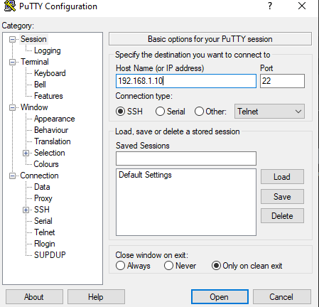

# Лабораторная работа №3

Министерство образования Республики Беларусь

Учреждение образования

«Брестский государственный технический университет»

Кафедра ИИТ

    

Лабораторная работа №3

По дисциплине: «ТИМАУ»

   

Выполнила

Студентка 3-го курса

Группы АС-64

Будник А.А.

Проверил

Иванюк Д.С.

   

Брест 2024

---

## Ход работы

### Ход работы:

1. Был клонирован репозиторий "savushkin-r-d/PLCnext-howto" на компьютер, и в Visual Code был собран исполняемый файл "hello_PLCnext" с использованием CMake.

2. Контроллер был подключен через LAN-кабель после настройки IPV-4 соединения. В свойствах подключения был установлен IP-адрес "192.168.1.1" и маска сети "255.255.255.0".

3. Для проверки соединения использовалась команда "ping 192.168.1.10" в командной строке, где "192.168.1.10" — это IP-адрес контроллера. Пакеты не терялись, что подтверждало правильность настройки соединения.

4. На компьютер были установлены две программы: PuTTY и WinSCP.
5. С помощью PuTTY было установлено соединение с контроллером, указав его IP-адрес, логин "admin" и пароль.

6. Через WinSCP исполняемый файл был передан в корневую директорию контроллера, после чего были введены IP-адрес, логин и пароль для подключения.

7. Были изменены права доступа, чтобы исполняемый файл можно было запустить.

8. Исполняемый файл был запущен и проверена корректность работы проекта.

В процессе выполнения лабораторной работы был разработан тестовый проект "Hello PLCnext from AS0xxyy!" и приобретены практические навыки взаимодействия с контроллером AXC F 2152.