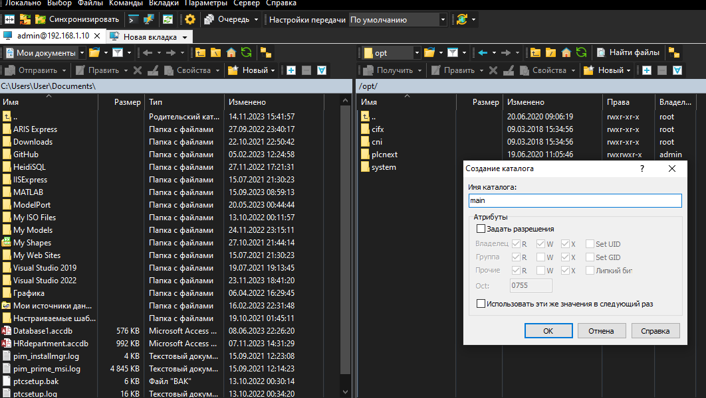
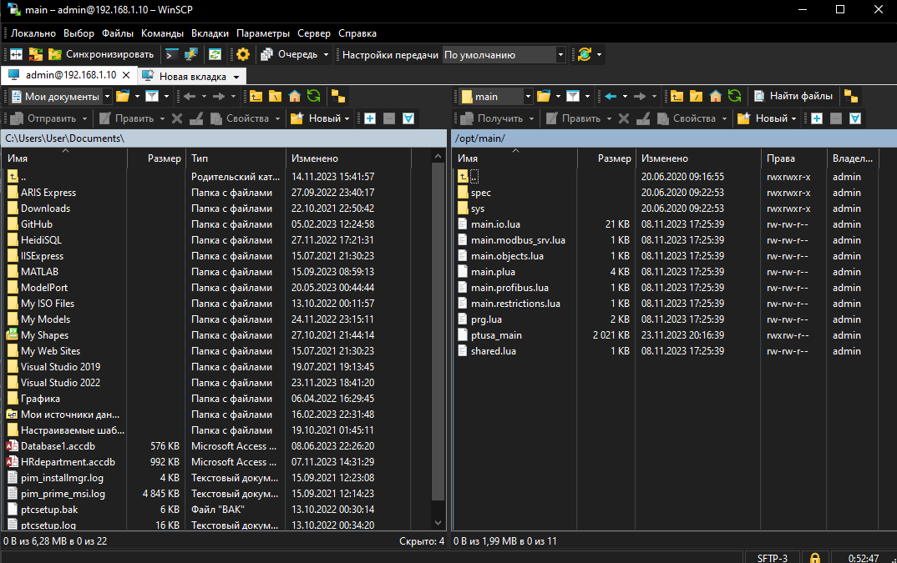
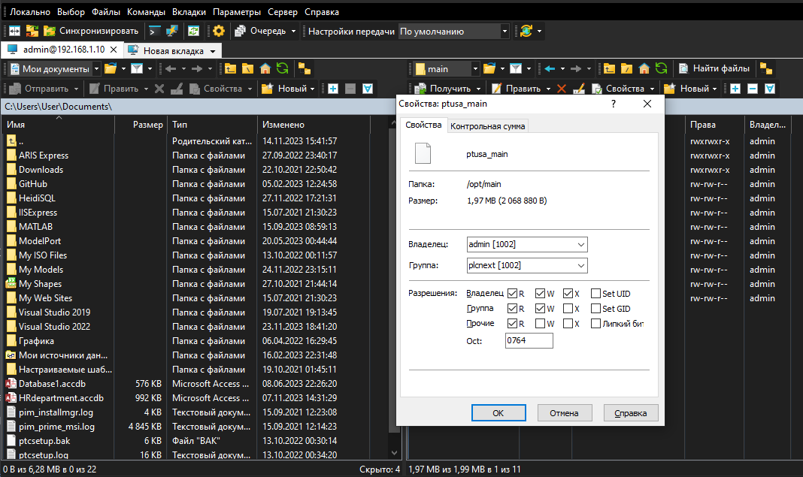

# Лабораторная работа №4

Министерство образования Республики Беларусь

Учреждение образования

«Брестский государственный технический университет»

Кафедра ИИТ

    

Лабораторная работа №4

По дисциплине: «ТИМАУ»

   

Выполнила

Студентка 3-го курса

Группы АС-64

Будник А.А.

Проверил

Иванюк Д.С.

   

Брест 2024

---

## Ход работы

1. Клонировать репозиторий "savushkin-r-d/ptusa_main" на компьютер и собрать исполнимый файл "ptusa_main" в Visual Studio 2022.

2. Выполнить шаги с 2 по 5 из [третьей](https://github.com/brstu/TMAU-2024/tree/main/trunk/as0006433/task_03/doc) лабораторной работы, перейдя по следующей ссылке

3. Создать директорию в корне контроллера, например, /opt/main/. Перенести файлы с расширениями .lua и .plua, директории spec и sys из проекта T1-PLCnext-Demo и исполнимый файл на контроллер с помощью программы WinSCP.

4. Изменить права доступа для запуска исполнимого файла.

5. Запустить исполнимый файл с использованием следующей команды:

