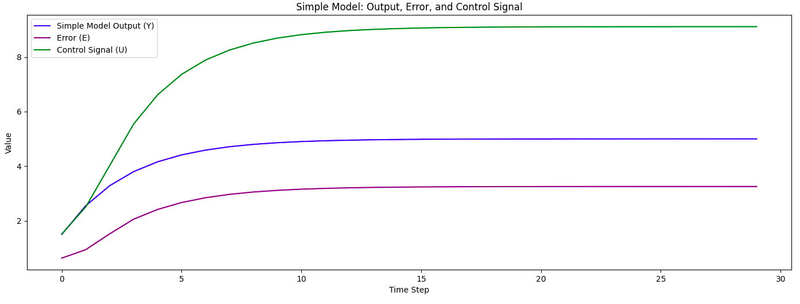
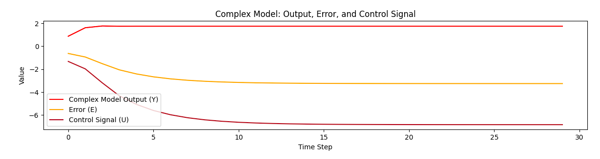

# Лабораторная работа №2
<p align="center">Министерство образования Республики Беларусь</p>
<p align="center">Учреждение образования</p>
<p align="center">«Брестский государственный технический университет»</p>
<p align="center">Кафедра ИИТ</p>
<br><br><br><br>
<p align="center">Лабораторная работа №2</p>
<p align="center">По дисциплине: «ТИМАУ»</p>
<p align="center">Тема: «Изучение ПИД-регуляторов»</p>
<br><br><br>
<p align="right">Выполнил</p> 
<p align="right">Студент 3-го курса</p>
<p align="right">Группы АС-64</p>
<p align="right">Кашпир Д.Р.</p>
<p align="right">Проверил</p>
<p align="right">Иванюк Д.С.</p>
<br><br><br>
<p align="center">Брест 2024</p>

---

## Цель работы:  
Разработать на языке C++ программу, моделирующую ПИД-регулятор, используя объект управления, представленный в виде математической модели, полученной в предыдущей работе. Программа должна быть реализована с применением ООП-подхода, включая минимум три различных класса и наследование. Отчет должен содержать графики для различных температур объекта и интерпретацию полученных результатов. Документация оформляется в формате Markdown (.md) с помощью Doxygen.

## Ход работы  
Была создана программа на языке C++, моделирующая ПИД-регулятор. Документация оформлена с использованием Doxygen и сохранена в формате .md. Все результаты работы программы записаны в файл results.txt, который находится в каталоге doc вместе с .md документами.

## Результаты 

### Линейная модель

Результаты:

```
== Simple Model Simulation ==
E=0.630306 Y=0.869694 U=1.51273
E=0.93922 Y=1.61078 U=2.44322
E=1.52021 Y=1.76479 U=4.37149
E=2.05785 Y=1.74165 U=6.49357
E=2.41331 Y=1.74634 U=8.57213
E=2.66633 Y=1.74542 U=10.7265
E=2.84263 Y=1.7456 U=12.9148
...
```

График:



### Нелинейная модель

Результаты:

```
== Complex Model Simulation ==
E=3.25435 Y=1.74557 U=67.3815
E=3.25437 Y=1.74557 U=69.6596
E=3.25439 Y=1.74557 U=71.9377
E=3.2544 Y=1.74557 U=74.2158
E=3.25441 Y=1.74557 U=76.4939
E=3.25441 Y=1.74557 U=78.772
E=3.25442 Y=1.74557 U=81.0501
...
```

График:



## Вывод
В ходе лабораторной работы была разработана программа на языке C++, моделирующая работу ПИД-регулятора. Для документирования использован Doxygen, с последующим преобразованием в Markdown (.md). Результаты работы программы сохранены в файл results.txt.