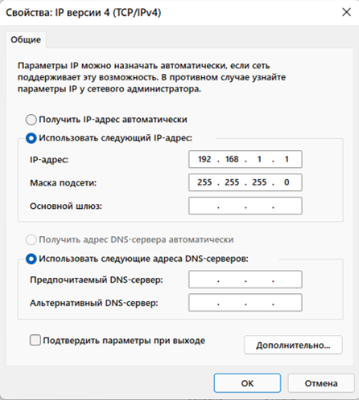
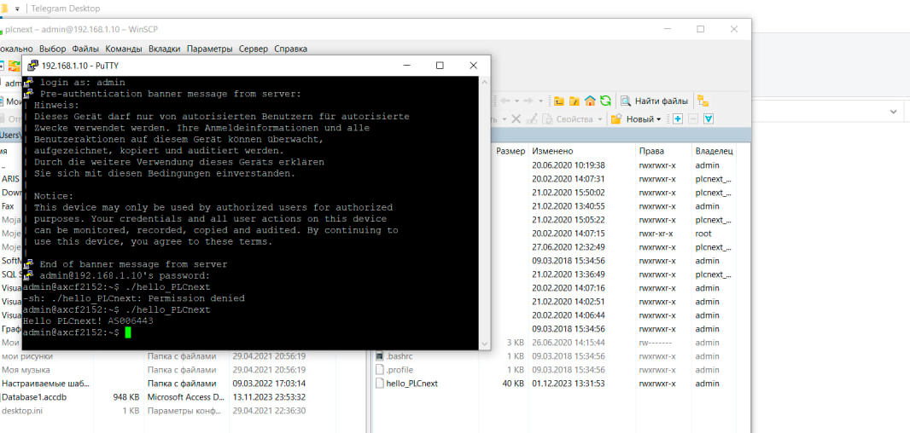
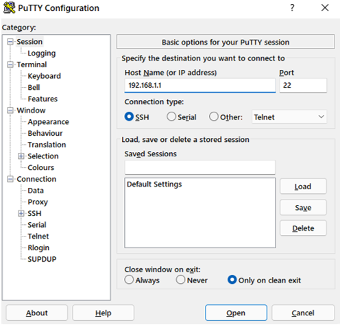
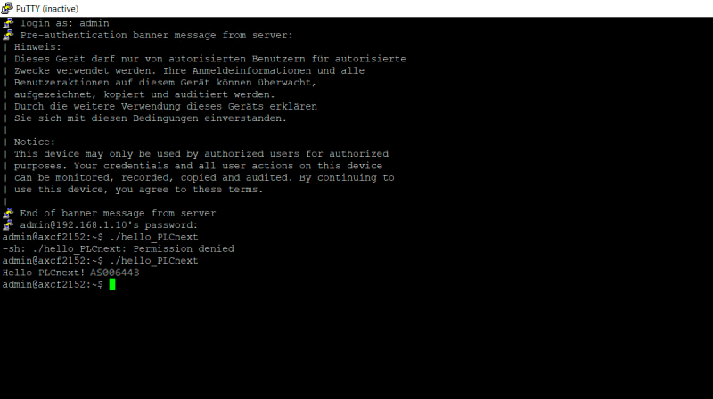
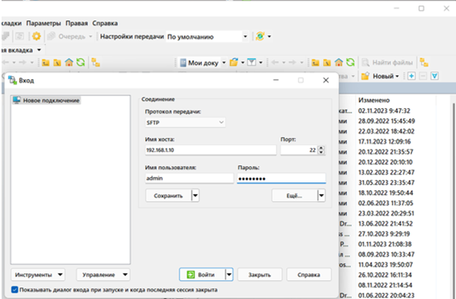
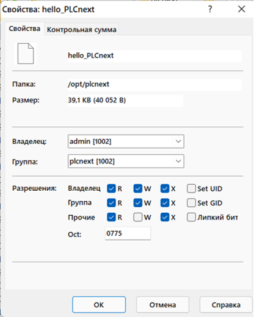
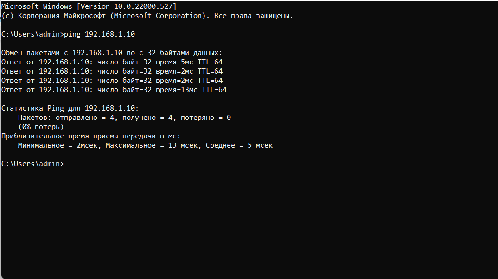

# Лабораторная работа №2

Министерство образования Республики Беларусь

Учреждение образования

«Брестский государственный технический университет»

Кафедра ИИТ

    

Лабораторная работа №3

По дисциплине: «ТИМАУ»

Тема: «Работа с контроллером AXC F 2152»

   

Выполнил
 

Студент 3-го курса

Группы АС-64

Кашпир Д.Р.

Проверил

Иванюк Д.С.

   

Брест 2024

---

## Цель работы:

Используя Visual Code, создайте тестовый проект «Hello PLCnext from AS06208!», соберите его и продемонстрируйте производительность на тестовом контроллере.

### Ход работы
1. В соответствии с поставленной задачей, клонируем репозиторий на локальный компьютер и собираем исполняемый файл под названием "hello_PLCnext". После этого необходимо скомпилировать проект и продемонстрировать его работоспособность на контроллере AXC F 2152.

2. Затем подключаемся к контроллеру через LAN-кабель, предварительно настроив параметры IPV-4 соединения. В свойствах соединения указываем IP-адрес "192.168.1.1" и маску "255.255.255.0".

3. Для проверки связи выполняем команду «ping 192.168.1.10» в командной строке, где "192.168.1.10" является IP-адресом контроллера. Если пакеты передаются без потерь, соединение установлено корректно.

4. На компьютере устанавливаем программы PuTTY и WinSCP.

5. Используя PuTTY, подключаемся к контроллеру, вводя его IP-адрес, а также логин "admin" и пароль "785*****".

6. На следующем этапе переносим собранный исполняемый файл в корневую директорию контроллера с помощью WinSCP, указав IP-адрес, логин и пароль.

7. Далее необходимо задать права доступа для запуска исполняемого файла.

8. Запускаем исполняемый файл.

## Вывод
В процессе лабораторной работы была усвоена сборка проекта для контроллера AXCF 2152 и его запуск на устройстве.