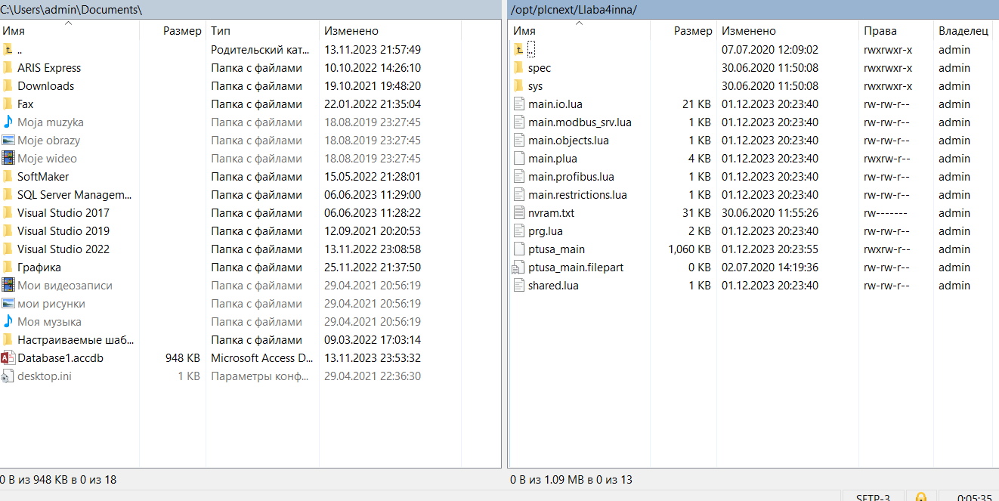
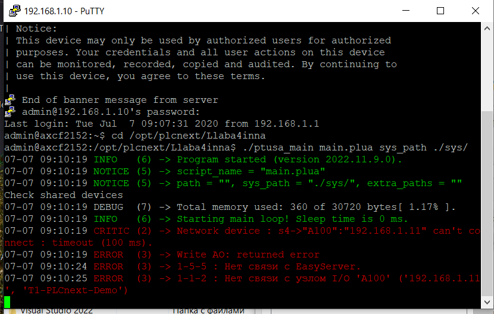

# Лабораторная работа №4
<p align="center">Министерство образования Республики Беларусь</p>
<p align="center">Учреждение образования</p>
<p align="center">«Брестский государственный технический университет»</p>
<p align="center">Кафедра ИИТ</p>
<br><br><br><br>
<p align="center">Лабораторная работа №4</p>
<p align="center">По дисциплине: «ТИМАУ»</p>
<p align="center">Тема: «Работа с контроллером AXCF 2152»</p>
<br><br><br>
<p align="right">Выполнил</p> 
<p align="right">Студент 3-го курса</p>
<p align="right">Группы АС-64</p>
<p align="right">Кашпир Д.Р.</p>
<p align="right">Проверил</p>
<p align="right">Иванюк Д.С.</p>
<br><br><br>
<p align="center">Брест 2024</p>

---

## Цель работы:
Ознакомиться с общей информацией о PLCnext, изучить проект ptusa_main, выполнить его сборку и запустить на тестовом контроллере.

### Ход работы
1. Клонируем репозиторий «savushkin-r-d/ptusa_main» на локальный компьютер и собираем исполняемый файл «ptusa_main» с помощью Visual Studio 2022.

2. Выполняем шаги 2-5 из предыдущей лабораторной работы для настройки сети и подготовки соединения с контроллером.

3. В корневом каталоге контроллера создаем директорию, например, ```/opt/main/```, и переносим туда файлы с расширениями .lua и .plua, а также каталоги spec и sys из проекта T1-PLCnext-Demo вместе с собранным исполняемым файлом, используя WinSCP.


4. Подключаемся к контроллеру через PuTTY, после чего запускаем исполняемый файл с использованием следующей команды
```
./ptusa_main  main.plua  sys_path ./sys/
```


## Вывод
В результате проделанной работы мы изучили функциональные возможности PLCnext, успешно собрали проект ptusa_main и проверили его работоспособность на тестовом контроллере.