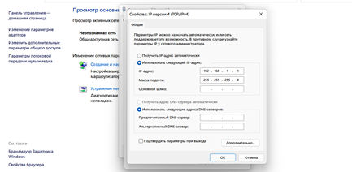
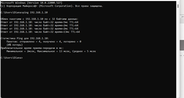
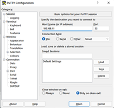
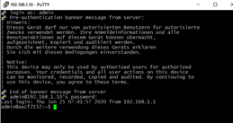
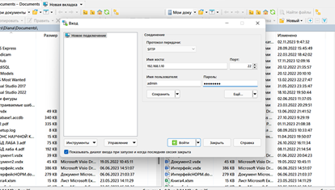
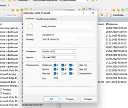

Министерство образования Республики Беларусь

Учреждение образования

«Брестский государственный технический университет»

Кафедра ИИТ

    

Лабораторная работа №3

По дисциплине “ТиМАУ”

Тема: “Работа с контроллером AXC F 2152”

   

Выполнил
 

Студент 3-го курса

Группы АС-64

Котковец К.В.

Проверил

Иванюк Д.С.

   

Брест 2024

---

# Лабораторная работа №3. Работа с контроллером AXC F 2152
## Цель работы

В рамках этой лабораторной работы необходимо ознакомиться с основами платформы PLCnext. Используя Visual Studio, следует создать проект с приветственным сообщением "Hello PLCnext from AS0xxyy!", выполнить его сборку и проверить работоспособность на тестовом контроллере.

## Задание
1. Изучить информацию о платформе PLCnext.
2. Ознакомиться с руководством пользователя.
3. Создать тестовый проект "Hello PLCnext from AS0xxyy!" в Visual Studio, собрать его и протестировать на контроллере.

## Ход выполнения
Для выполнения лабораторной работы создаём проект hello_PLCnext в Visual Studio.

Настраиваем подключение к контроллеру и конфигурируем сеть, после чего проверяем успешность подключения.

Подключаемся к контроллеру с помощью программы PuTTY Configuration.

Авторизуемся, введя логин и пароль.

Используем WinSCP для связи с контроллером.

Загружаем собранный проект в корневой каталог контроллера, изменяем разрешения для запуска и запускаем проект, чтобы увидеть результат.

## Вывод
В результате лабораторной работы изучены основы платформы PLCnext, создан и собран тестовый проект, а также продемонстрирована его работоспособность на тестовом контроллере.