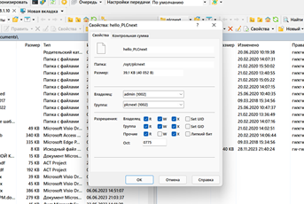
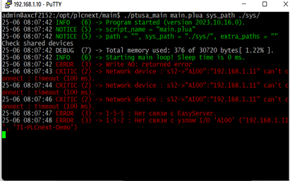

<p align="center">Министерство образования Республики Беларусь</p>
<p align="center">Учреждение образования</p>
<p align="center">«Брестский государственный технический университет»</p>
<p align="center">Кафедра ИИТ</p>
<br><br><br><br>
<p align="center">Лабораторная работа №4</p>
<p align="center">По дисциплине “ТиМАУ”</p>
<p align="center">Тема: “Работа с контроллером”</p>
<br><br><br>
<p align="right">Выполнил</p> 
<p align="right">Студент 3-го курса</p>
<p align="right">Группы АС-64</p>
<p align="right">Котковец К.В.</p>
<p align="right">Проверил</p>
<p align="right">Иванюк Д.С.</p>
<br><br><br>
<p align="center">Брест 2024</p>

---

# Лабораторная работа №4. Работа с контроллером
## Цель работы

Задача работы — ознакомиться с основными принципами работы платформы PLCnext, изучить проект [ptusa_main](https://github.com/savushkin-r-d/ptusa_main), а также выполнить его сборку в среде Visual Studio. В процессе выполнения нужно приобрести опыт работы с тестовым контроллером, продемонстрировать на нём работу проекта, а также развить навыки работы с различными платформами.

## Ход выполнения

Для анализа проекта [ptusa_main](https://github.com/savushkin-r-d/ptusa_main) используется среда Visual Studio, которая обеспечивает удобную платформу для разработки и отладки приложений на PLCnext. Проект собирается и загружается на контроллер для проверки его функциональности, что позволяет на практике освоить использование возможностей этой платформы.

Сначала клонируем репозиторий [ptusa_main](https://github.com/savushkin-r-d/ptusa_main), как указано в задании:

```
git clone --recurse-submodules https://github.com/savushkin-r-d/ptusa_main.git
```

Сборка выполняется в Visual Studio, подходящей для создания сложных приложений. После сборки подключаемся к контроллеру аналогично шагам в третьей лабораторной работе.

Настраиваем права доступа, добавляя необходимые привилегии (например, владельца и группу) для запуска исполняемого файла, после чего выполняем команду для его запуска:



```
./ptusa_main  main.plua  sys_path  ./sys/
```

Получаем следующий результат:



## Вывод

В ходе работы был изучен проект [ptusa_main](https://github.com/savushkin-r-d/ptusa_main), получены навыки работы с тестовым контроллером на платформе PLCnext, а также проведена сборка проекта в Visual Studio. Это позволило приобрести ценный опыт в автоматизации и программировании, а также оценить возможности платформы PLCnext на практике.
