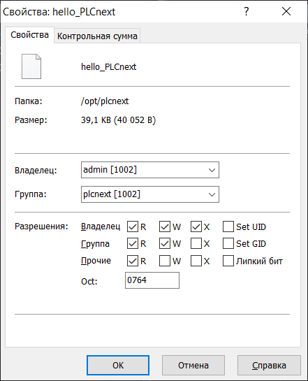
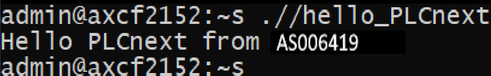

<p align="center">Министерство образования Республики Беларусь</p>
<p align="center">Учреждение образования</p>
<p align="center">“Брестский Государственный технический университет”</p>
<p align="center">Кафедра ИИТ</p>
<br><br><br><br><br><br>
<p align="center"><strong>Лабораторная работа №3</strong></p>
<p align="center"><strong>По дисциплине</strong> “Теория и методы автоматического управления”</p>
<p align="center"><strong>Тема:</strong> “Работа с контроллером AXC F 2152”</p>
<br><br><br><br><br><br>
<p align="right"><strong>Выполнил</strong>:</p>
<p align="right">Студент 3 курса</p>
<p align="right">Группы АС-64</p>
<p align="right">Хомич В.Г.</p>
<p align="right"><strong>Проверил:</strong></p>
<p align="right">Ситковец Я.С.</p>
<br><br><br><br><br>
<p align="center"><strong>Брест 2024</strong></p>

---

**Задание**

1. Ознакомиться с общей информацией о платформе **PLCnext** [здесь](https://www.plcnext.help/te/About/Home.htm).
2. Изучить [руководство](https://github.com/savushkin-r-d/PLCnext-howto/tree/master/HowTo%20build%20program%20Hello%20PLCnext).
3. Используя **Visual Code** создать тестовый проект *"Hello PLCnext from AS0xxyy!"*, собрать его и продемонстрировать работоспособность на тестовом контроллере.
4. Написать отчет по выполненной работе в .md формате (readme.md) и с помощью pull request разместить его в следующем каталоге: trunk\as000xxyy\task_03\doc.


<p> <strong>Цель:</strong> создать тестовый проект "Hello PLCnext from AS0xxyy!", собрать его и продемонстрировать его работу на контроллере.</p>

<p> <strong>Решение:</strong> </p>

<p>Следуя заданию нам нужно клонировать репозиторий</p>

<p>Чтобы выполнить сборку файла, вводим следующие команды в терминале:</p>


 ``` bash
cmake --preset=build-windows-AXCF2152-2021.0.3.35554 .
```


 ``` bash
cmake --build --preset=build-windows-AXCF2152-2021.0.3.35554 --target all
```


 ``` bash
cmake --build --preset=build-windows-AXCF2152-2021.0.3.35554 --target install
```

<p>Настраиваем сетевые параметры контроллера для взаимодействия.</p>

  

<p>Проверяем соединение с контроллером, чтобы убедиться в корректности конфигурации.</p>

  

<p>Используем приложение put_con для доступа к контроллеру.</p>

 

<p>Вводим учетные данные для доступа.</p>

 

<p>Запускаем WinCP для окончательного подключения к контроллеру.</p>

 

<p>Переносим собранный проект в корневую папку контроллера и изменяем разрешения на файлы, чтобы обеспечить возможность их запуска.</p>

 

<p>После завершения настройки запускаем проект и проверяем результат.</p>

 

<p> <strong>Вывод:</strong> В процессе выполнения этой работы был разработан тестовый проект "Hello PLCnext from AS0xxyy!", что позволило нам освоить основные этапы работы с контроллером AXC F 2152 и получить полезный опыт.<em>AXC F 2152</em>.</p>