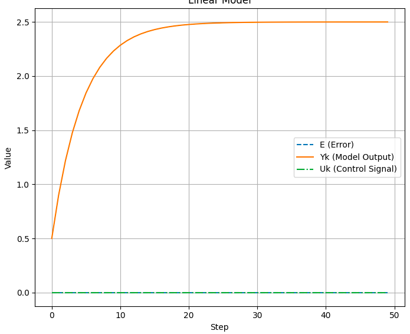
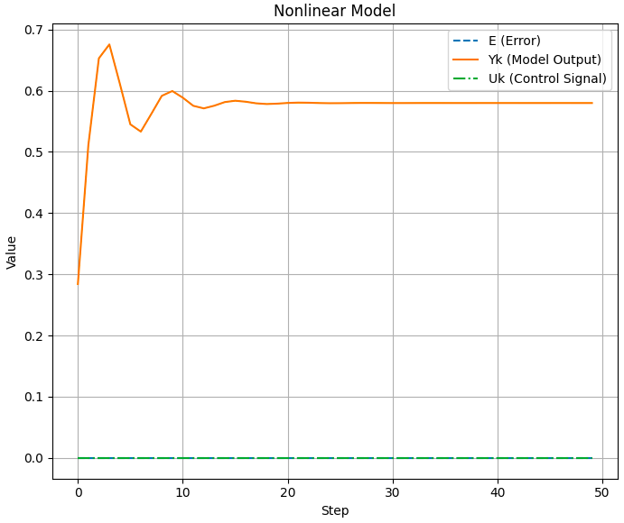

# Лабораторная работа №2

Министерство образования Республики Беларусь

Учреждение образования

«Брестский государственный технический университет»

Кафедра ИИТ

    

Лабораторная работа №2

По дисциплине: «ТИМАУ»

Тема: «Изучение ПИД-регуляторов»

   

Выполнил
 

Студент 3-го курса

Группы АС-64

Горкавчук Н.М.

Проверил

Иванюк Д.С.

   

Брест 2024

---

## Цель работы:  
На языке программирования C++ реализовать программу, которая будет моделировать ПИД-регулятор. В качестве объекта управления использовать математическую модель, которую мы получили в предыдущей работе. Использовать метод программирования ООП, в программе должно быть не менее 3-х различных классов (+наследование). В отчете также требуется привести графики для разных температур объекта, пояснить полученные результаты (отчет получать с помощью Doxygen в .md формате). 

## Ход работы  
Реализовал программу на языке программированяи c++, которая моделируюет работу ПИД-регулятор. Документация программы была сделана с помощью Doxygen и переведенна в md формат. Результаты работы данной программы были записаны в файл results.txt. Он лежит в каталоге doc, вместе с .md.

## Результаты 

### Линейная модель

выходные значения в файле result.txt

### Нелинейная модель

выходные значения в файле result.txt

## Вывод
В ходе лабораторной работы былареализована программа на языке С++, которая моделирует работу ПИД-регулятора. Для документирования программы был использован инструмент Doxygen, затем документация была преобразована в Markdown (.md). Результат работы программы записан в файл results.txt.