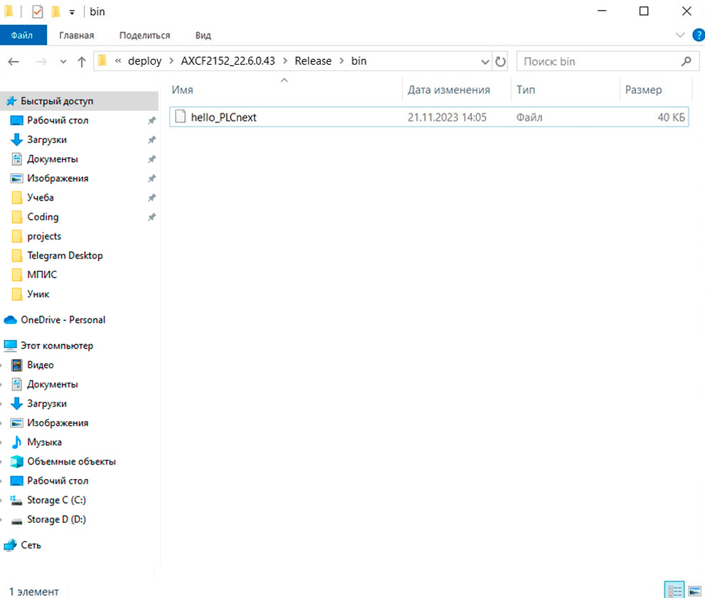
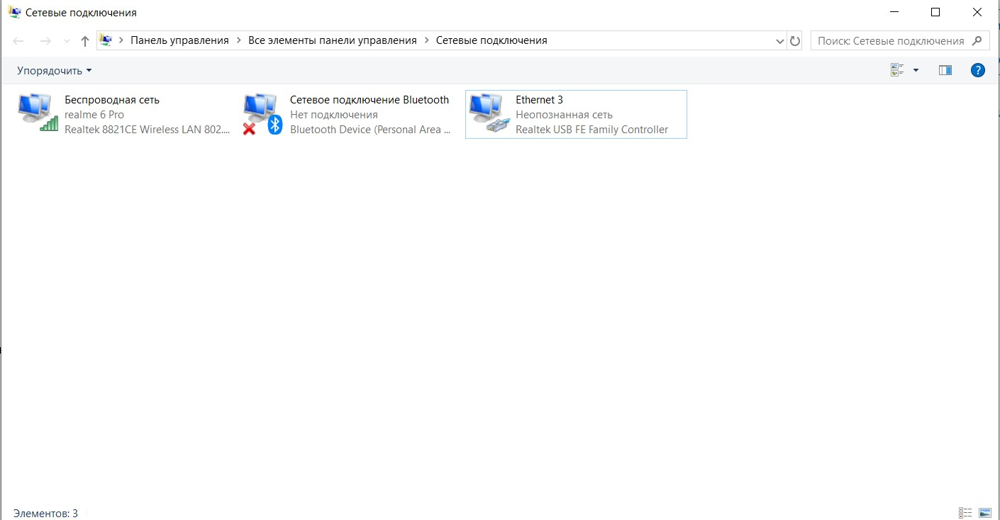
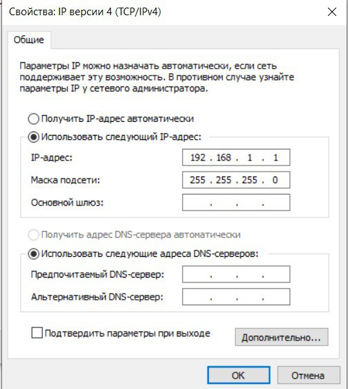
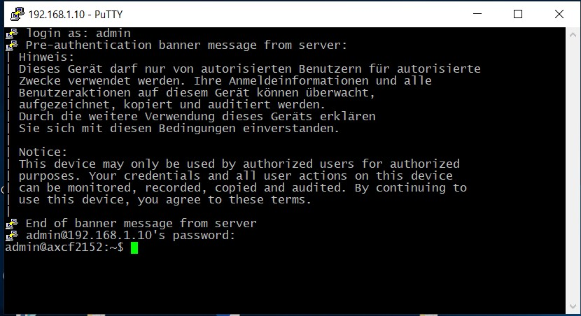
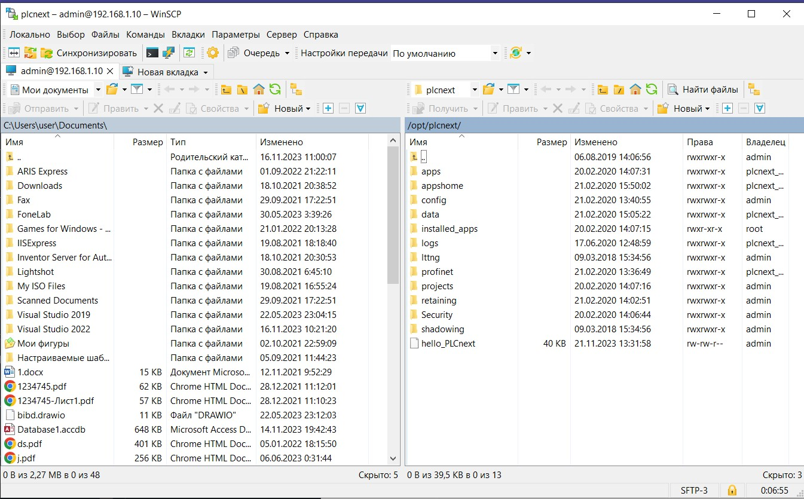
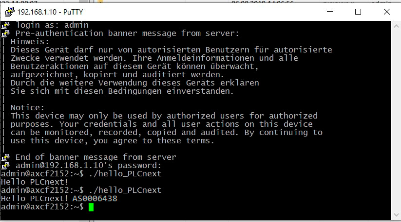

# Лабораторная работа №3
<p align="center">Министерство образования Республики Беларусь</p>
<p align="center">Учреждение образования</p>
<p align="center">«Брестский государственный технический университет»</p>
<p align="center">Кафедра ИИТ</p>
<br><br><br><br>
<p align="center">Лабораторная работа №3</p>
<p align="center">По дисциплине: «ТИМАУ»</p>
<p align="center">Тема: «Работа с контроллером AXC F 2152»</p>
<br><br><br>
<p align="right">Выполнил</p>
<p align="right">Студент 3-го курса</p>
<p align="right">Группы АС-64</p>
<p align="right">Горкавчук Н.М.</p>
<p align="right">Проверил</p>
<p align="right">Иванюк Д.С.</p>
<br><br><br>
<p align="center">Брест 2024</p>

---

## Цель работы:
Cоздать тестовый проект "Hello PLCnext from AS0xxyy!", собрать его и продемонстрировать работоспособность на тестовом контроллере.

## Решение
Клонируем репозиторий и собираем проект с помощью следующих команд

```
cmake --preset=build-windows-AXCF2152-2022.6.0.43 .
```
```
cmake --build --preset=build-windows-AXCF2152-2022.6.0.43 --target all .
```
```
cmake --build --preset=build-windows-AXCF2152-2022.6.0.43 --target install .
```

**В итоге создается файл с именем hello_PLCnext.**


**Подключаемся к контроллеру**



**Проверяем соединение с контроллером, используя команду ping 192.168.1.1, и получаем следующий ответ**


**Устанавливаем программу PuTTY Configuration, открываем ее и подключаемся к контроллеру**


**Выполняем авторизацию для подключения к контроллеру**


**Устанавливаем программу WinCP, вводим IP-адрес и проходим авторизацию**


**Загружаем бинарный файл hello_PLCnext в корневой каталог контроллера и изменяем его параметры**


**Запускаем проект и видим следующий результат**


## Вывод

В процессе выполнения лабораторной работы были получены навыки работы с контроллером AXC F 2152