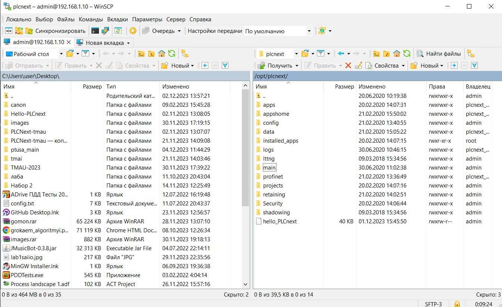

# Лабораторная работа №4
<p align="center">Министерство образования Республики Беларусь</p>
<p align="center">Учреждение образования</p>
<p align="center">«Брестский государственный технический университет»</p>
<p align="center">Кафедра ИИТ</p>
<br><br><br><br>
<p align="center">Лабораторная работа №4</p>
<p align="center">По дисциплине: «ТИМАУ»</p>
<p align="center">Тема: «Работа с контроллером AXCF 2152»</p>
<br><br><br>
<p align="right">Выполнил</p>
<p align="right">Студент 3-го курса</p>
<p align="right">Группы АС-64</p>
<p align="right">Горкавчук Н.М.</p>
<p align="right">Проверил</p>
<p align="right">Иванюк Д.С.</p>
<br><br><br>
<p align="center">Брест 2024</p>

---

## Цель работы:
Изучить общую информацию о PLCnext, разобраться с проектом ptusa_main, собрать его и запустить на тестовом контроллере.

## Решение
Сначала требуется собрать файл ptusa_main в Visual Studio. Для этого сначала клонируем репозиторий, введя команду:

```
git clone --recurse-submodules https://github.com/savushkin-r-d/ptusa_main.git 
```

Открываем репозиторий в Visual Studio, затем собираем проект с помощью CMake, где в итоге получаем файл ptusa_main


Затем подключаемся к контроллеру, проверяем соединение, авторизуемся в PuTTY Configuration и WinSCP, создаем каталог "main", где будут размещены необходимые файлы для запуска программы.



Запускаем исполняемый файл с помощью PuTTY.


## Вывод
В ходе лабораторной работы была изучена общая информация о платформе PLCnext, а также выполнен запуск проекта ptusa_main на контроллере.